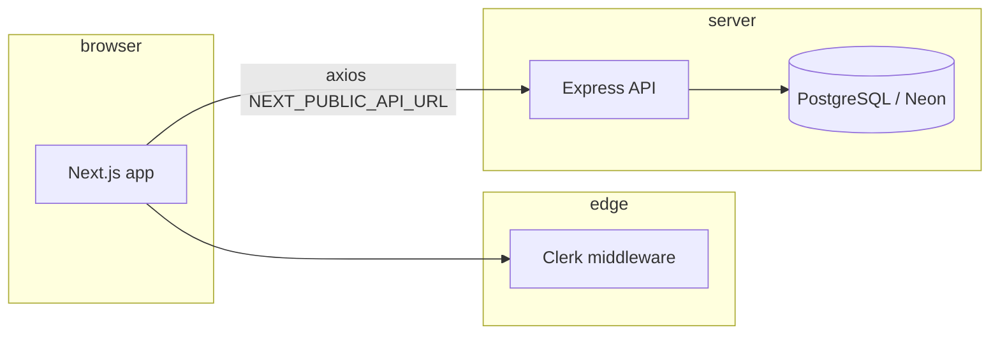

# Science of the project — MVP (engineering)

**Living document.** Edit this file anytime the stack, auth, or deployment changes. Optional: add dated bullets under [Revision log](#revision-log) at the bottom.

**Related:** Clinical positioning, outcomes messaging, and achievement notes live in `SCIENCE_AND_ACHIEVEMENTS.md`. This file focuses on **how the software is built and run**.

**GitHub & Render:** **Not required** for the MVP. You can develop and test entirely on your machine (Express + Next + Neon or local DB). Pushing to GitHub and deploying to Render (or any host) is **optional** whenever you decide you want a public URL or CI — not a prerequisite for building or validating the app.

**Git + Windows + Cursor issues (push failures, `.cursor` locks, PowerShell paste traps):** see `CURSOR_GIT_AND_WINDOWS.md`.

---

## 1. Stack at a glance

| Layer | Technology | Role |
|--------|------------|------|
| **Client (browser)** | Next.js 15 (App Router), React 18, TypeScript, Tailwind CSS | Pages, SEO routes, tools, dashboard-style areas, API calls to your backend |
| **Auth (app + edge)** | Clerk (`@clerk/nextjs`) | Sign-in / sign-up UI, session, route protection via `web/middleware.ts`, `ClerkProvider` in `web/app/layout.tsx` |
| **API server** | Node.js 20, Express 4 | REST API: health, auth, assessments, NutriBot, gallery (see `server/server.js`) |
| **Database** | PostgreSQL via `pg` (connection pool), typically **Neon** | Users, assessments, gallery, etc. — **database name is project-specific** (not a fixed label like “heart”) |
| **HTTP client (web)** | Axios (`web/lib/api.ts`) | Calls `NEXT_PUBLIC_API_URL` (e.g. `http://localhost:5000/api`); can attach `Bearer` token from storage when used |
| **Deploy (optional)** | Render, Vercel, VPS, etc. | Only when you want production; separate services + env vars for API URL and DB |

**Principle:** The browser does **not** talk to Postgres directly. Next.js talks to **Express**; Express talks to **Postgres**.

---

## 2. Request flow (diagram)



---

## 3. Repository tree (engineering)

```
DR-MUDDUS-MVP-MIRACLE-VALUE-PROPOSITION/
├── web/                          # Next.js frontend
│   ├── app/                      # App Router: pages, auth routes, dashboard, conditions, blog, …
│   ├── components/               # Shared UI
│   ├── lib/                      # api.ts, auth-context, …
│   ├── middleware.ts             # Clerk: public vs protected routes
│   ├── public/                   # Static assets, PWA
│   └── .env.local                # NEXT_PUBLIC_* , Clerk keys (local)
├── server/                       # Express backend
│   ├── server.js                 # Entry: middleware, route mounting
│   ├── config/database.js        # `pg` Pool + DATABASE_URL
│   ├── routes/                   # auth, assessments, nutribot, gallery, …
│   ├── scripts/                  # DB tests, migrations helpers, schema inspection
│   ├── migrations/               # SQL migration snippets
│   ├── schema.sql                # Reference / bootstrap SQL
│   └── .env                      # DATABASE_URL, JWT_SECRET, PORT, …
├── SCIENCE_OF_THE_MVP.md         # This file (edit as the MVP evolves)
└── SCIENCE_AND_ACHIEVEMENTS.md   # Clinical “science” + milestones
```

---

## 4. Database access: raw `pg` (not Prisma on the server)

- The **Express** app uses **`pg`** with a **connection pool** and **`pool.query(...)`** with parameterized SQL (`$1`, `$2`, …).
- **Prisma is not** a dependency of `server/package.json` today.
- **When to keep raw `pg`:** Small API surface, fast iteration; stay strict on parameterized queries.
- **When to add Prisma or Drizzle:** You want schema-derived types, safer refactors across many tables, or a clearer migration workflow for a larger team. Prefer **one** style per area to avoid half-ORM confusion.

---

## 5. Backend “weight” and scaling (MVP-level)

- **Today:** REST handlers + SQL — auth, assessments, NutriBot-related updates, gallery CRUD/order. This is **moderate** I/O-bound work, not heavy CPU on Node by default.
- **If** you add long-running jobs (e.g. heavy LLM pipelines, big batch reports), consider **queues**, **timeouts**, and **rate limits** before changing the ORM.
- **Scaling shape:** Stateless Express behind a load balancer; tune **`pg` pool size** and use Neon’s pooler if needed; add caching or read replicas only when metrics justify it.
- **Clerk** scales as a managed auth product; early bottlenecks are usually **database and API**, not Clerk.

---

## 6. Auth: Clerk vs “backend-only JWT”

- **As built:** **Clerk** handles end-user sign-in/sign-up and **middleware-based** protection of routes. See `web/CLERK-AUTH-AND-RUN.md` for runbook detail.
- **Express** still includes **bcrypt** + **jsonwebtoken** and routes under `/api/auth` for a **classic email/password API** — useful for mobile or a future unified token story.
- **You do not need Clerk** in the abstract for a full-stack app; many teams use only JWT/cookies from their own backend. **For this codebase,** removing Clerk would mean replacing sessions, protected routes, and sign-in UI, then aligning `web/lib/api.ts` and any server middleware to one auth model.

---

## 7. Environment alignment (checklist)

- **`web/.env.local`:** `NEXT_PUBLIC_API_URL` points at the running API (e.g. `http://localhost:5000/api` locally).
- **`server/.env`:** `DATABASE_URL` (Neon connection string), `JWT_SECRET` (if using backend JWT), `PORT`.
- **Clerk:** Keys in `web` per Clerk dashboard; callback URLs must match deployed hostnames.

---

## 8. Local run (typical)

- Backend: from `server/`, `npm run dev` (or `npm start`) — default port **5000**.
- Frontend: from `web/`, `npm run dev` or `npm run dev:mem` — project uses port **3003** in `package.json`.

---

## Revision log

_Add dated one-line notes when you change architecture, auth, or deploy._

- **2026-03-23** — Initial version: Next.js + Express + `pg`/Postgres, Clerk auth on web, scaling/ORM guidance consolidated from team discussion.
- **2026-03-23** — Clarified: GitHub push and Render deploy are optional, not required for local MVP work.
- **2026-03-23** — Added `CURSOR_GIT_AND_WINDOWS.md` (Git/Windows/Cursor troubleshooting; link from this file).
